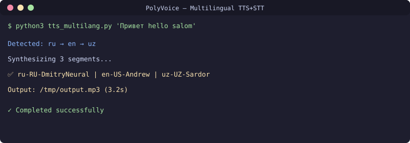

<div align="center">

[](README.md)
[](README.ru.md)
[](README.uz.md)

</div>

# Koʻp tilli TTS + STT konveyeri
[](https://github.com/uMax-Cyber/PolyVoice/actions/workflows/ci.yml)



AI agentlar uchun moʻljallangan uch tilli (rus/ingliz/oʻzbek) TTS va STT konveyeri: matnni nutqga aylantiradi va nutqni tanib oladi. Tillar aralash kirganda ham («bratan, nado sdelat legacy project, salom bolla») har bir segmentning tilini oʻzi aniqlaydi va toʻgʻri ovoz bilan oʻqiydi.

## ✨ Imkoniyatlar

- **Tilni avtomatik aniqlash** — kirill va lotin yozuvlari farqlanadi, oʻzbek tili leksik belgilar orqali taniladi
- **Bepul TTS** — Microsoft Edge neyron ovozlari ishlatiladi, API kalit ham kerak emas
- **Ishonchli STT** — asosiy dvigatel GigaAM Multilingual, ishdan chiqsa faster-whisper zaxira sifatida ishga tushadi
- **Buzilgan natijani aniqlash** — tillar aralashib natija chiqib qolsa, tanib olish zaxira dvigatel bilan qaytadan olib boriladi
- **Yakunda bitta fayl** — har bir segmentning audiosi ffmpeg yordamida bitta faylga birlashtiriladi

## Arxitektura

### TTS (matndan nutqga)
```
Kirish matni → Yozuv aniqlanadi (kirill/lotin) → Tillar boʻyicha segmentlanadi
→ Har bir segment alohida sintez qilinadi (edge-tts, bepul) → ffmpeg bilan birlashtiriladi → Tayyor audio
```

- **Ovozlar**: ru-RU-DmitryNeural, en-US-AndrewNeural, uz-UZ-SardorNeural
- **Aniqlash**: kirill → rus; lotin → ingliz yoki oʻzbek (leksik belgilar: salom, bolla, rahmat…)
- **Xarajat nolga teng**: Microsoft Edge TTS ishlatiladi — bepul, API kalit talab qilmaydi

### STT (nutqdan matnga)
```
Kirish audiosi → GigaAM multilingual (asosiy, 0.5 s) → Sifat tekshiriladi
→ Natija buzilgan boʻlsa → Whisper (zaxira) → Eng yaxshi natija
```

- **Asosiy dvigatel**: GigaAM Multilingual (Sberning ochiq modeli, MIT litsenziyasi)
- **Zaxira**: faster-whisper small
- **Sifat tekshiruvi**: aralash yozuvli buzilishlar aniqlanadi (masalan, «bатаn помоi» — tillar oʻz joyini almashgani)

## Ishlab chiqarishdan olingan xulosalar

1. **Oʻzbek tilida GigaAM Whisperdan kuchli** (lotin yozuvida): Whisper oʻzbekni fors tilidan ajrata olmaydi, GigaAM esa bemalol ajratadi
2. **Til almashinuvi — eng qiyin holat**: bitta audioda rus va oʻzbek aralash kelsa, GigaAM buzilgan matn chiqaradi — bu holatda Whisper yaxshiroq ishlaydi
3. **Edge TTS bepul va yetarli**: agentning ovozli javoblari uchun pulli APIlarga ehtiyoj yoʻq

## Oʻrnatish

```bash
# TTS (edge-tts)
pip install edge-tts

# STT (GigaAM)
git clone https://github.com/salute-developers/GigaAM.git
pip install -e GigaAM[torch]
```

## Foydalanish

```bash
# Matn va chiqish fayli (standart qiymatlar)
python3 scripts/tts_multilang.py "Привет! Hello! Salom!" /tmp/tts_output.mp3

# Aralash til — segmentlar alohida aniqlanadi va ovozlashtiriladi
python3 scripts/tts_multilang.py "bratan, nado sdelat legacy project, salom bolla" out.mp3
```

Segmentlarni birlashtirish uchun `ffmpeg` PATHda boʻlishi shart.

## Litsenziya
MIT

## 📬 Aloqa

Savollaringiz boʻlsa yozing: **[allumaxmail@gmail.com](mailto:allumaxmail@gmail.com)**

---

<div align="center">

[](README.md)
[](README.ru.md)
[](README.uz.md)

</div>
